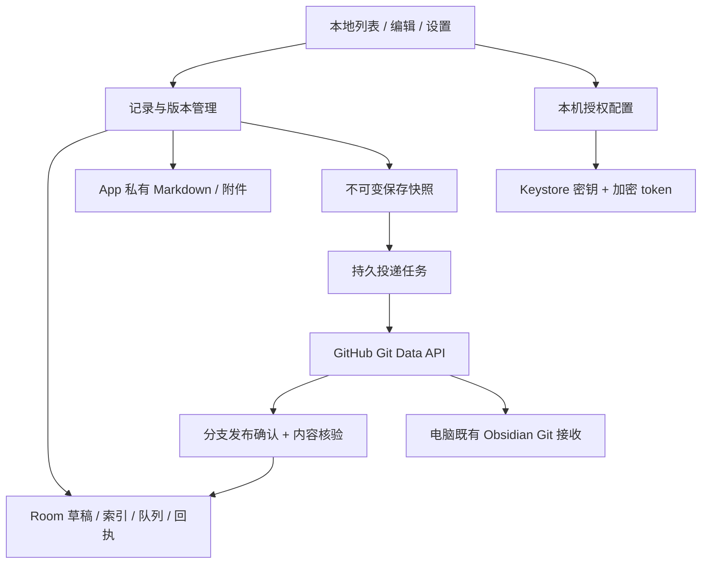

# Echo Android 独立 App 技术与迁移规划

日期：2026-10-08 · 状态：已确认实施，本地源码与验证完成；设备/真实仓库验收待执行。

功能与验收以 [android-requirements.md](android-requirements.md) 为准；本文规定能力如何从当前服务端迁入手机。现有 WebView 容器是历史原型，不能承担新方案的编辑、存储或投递核心。

## 1. 建议架构

首版建议 Kotlin + Jetpack Compose 原生界面、Room 本地元数据、私有 Markdown/附件文件、Android Keystore 和 WorkManager。复用 `apps/android/` 的工程与构建入口，不新建另一个顶层产品，也不在手机上运行 Node/Go 服务。

Compose 的具体版本、Markdown 编辑/渲染方案和录音格式在可行性阶段选择并锁定；先验证中文输入、checkbox、链接与图片，再确认依赖。不能把远端 Memos 页面重新放进 WebView 作为技术验证的替代。若预览需要本地渲染资源，须随 APK打包，且不负责存储、授权和投递。

Room 是本地 SQLite 的访问层，承担索引和任务关系；它本身不替代 Markdown 文件，也不提供凭据加密。[Room 官方说明](https://developer.android.com/training/data-storage/room)



Memos/Echo、电脑在线状态和 ObsidianHub 都不在手机核心依赖链中。未来接入 ObsidianHub 时增加独立适配，不在首版实现插件协议或提前制造空架构层。

## 2. 工程与数据结构边界

计划复用现有工程，新增源码包时按职责组织：

```text
apps/android/
  app/src/main/java/xyz/leedaud/echo/
    ui/            本地界面、导航、编辑与配置
    notes/         草稿、保存快照、续写与格式转换
    storage/       Room、文件写入日志与凭据封装
    delivery/      GitHub API、核验、恢复与 WorkManager
  app/src/test/             纯逻辑与 mock网络测试
  app/src/androidTest/      文件/数据库/界面/升级设备测试
  app/build/                忽略的 APK、测试报告与构建产物
docs/plan/                  需求、架构与阶段计划
docs/setup/                 配置、构建、验证说明
```

这是待确认后的结构，不在本轮创建空目录或实现代码。文件夹随功能落地创建，不使用通用 utils目录堆积业务。

手机运行时结构建议：

```text
App 私有数据区/
  databases/        本地索引、草稿、任务与回执
  files/notes/      按稳定 noteId / revision 保存正式 Markdown
  files/attachments/  已导入附件字节，按内部稳定 ID 管理
  files/outbox/     授权快照与发布检查点，不保存 Git对象历史
  files/secrets/    使用 Keystore 密钥加密的设备 token
  cache/           临时复制、缩略图和预览产物
```

上述数据绝不生成于电脑应用源码目录。运行时不是 Git clone；公开导出的正文仍为标准 Markdown，附件仍为普通文件。系统缓存可重建，正式记录、引用中的附件和不确定任务不得按缓存策略清理。实现期间只使用源码外或设备测试区的合成数据，实际内容导入另行授权。

### 数据记录草案

| 记录 | 必要职责与字段 |
| --- | --- |
| Note | 稳定 ID、创建/更新时间、笔记/待办、当前正式版本、标签、置顶/归档、父笔记 ID |
| Draft | noteId或新建会话 ID、草稿版本/基线、正文、附件引用、最后确认持久化时间 |
| Revision | noteId、单调版本号、Markdown 文件位置、内容摘要、附件清单、保存时间 |
| Attachment | 内部 ID、文件位置、原文件名、MIME、字节数、SHA-256、创建时间、复制状态 |
| Target | 稳定目标 ID、仓库数字 ID及 owner/name、分支、配置版本、凭据别名，不含明文 token |
| Delivery | submissionId、noteId/revision、目标绑定、父依赖、最终路径、状态/错误、下一次重试、执行租约 |
| Attempt | submissionId、父 head、候选 commit/tree、每个路径的 blob SHA、发布阶段，更新分支前持久化 |
| Receipt | submissionId、目标 ID/分支、发布 commit、路径与逐项摘要、核验时间 |
| FileJournal | 附件/Markdown 临时位置、最终位置、事务状态，用于文件与数据库跨介质恢复 |

字段名是设计草案，不是已经引入的存储格式。首次数据库为新建本地存储；后续本地版本升级需要显式迁移和设备测试，禁止以 destructive fallback清空数据。生产 Memos 数据库不变更。

## 3. 本地持久化与恢复协议

1. 附件先在私有 staging中有界复制，校验大小与摘要，完成后原子重命名；源系统 URI只用于复制，不作为永久附件存储。
2. 草稿编辑使用单写者和本地版本号，暂存立即等待落盘成功。多个异步写入不能让旧版本晚到覆盖新版本；SQLite 事务与文件写入完成证据一起决定成功提示。
3. 正式保存先建立文件日志，写入 Markdown及不可变附件清单，再提交 Revision与 Note索引；写文件和 Room事务不被描述为一个天然跨介质原子事务。
4. 开启投递时，同一次可恢复保存操作创建 Delivery；未开启时只创建本地 Revision。重复保存相同快照复用 submissionId；确认新内容才产生新 revision。
5. 首次投递冻结对应 revision，随后编辑不能改变 outbox的字节。错误、权限失效和核验不确定不会解除冻结。续写另建 Note和 Draft。
6. 启动时先恢复 FileJournal，再修复未调度的持久任务；只处理未完成的已授权记录，不扫描全部笔记并重新入队。
7. 磁盘满、复制失败或异常断电时，回滚未确认索引或完成已确认日志；不自动删除活跃草稿和未核验附件。所有版本升级保持文件/索引可恢复。

正文落盘和任务回执到达是独立事件；投递完成不触发本地记录清理。网络请求读取不可变快照，不直接读取正在编辑的正文。

## 4. GitHub 发布与核验

采用现有 `src/server/github.ts` 中 bundle发布语义的 Kotlin 实现，以当前合成测试作为行为对照，不能直接把 Node文件 API或 Go bridge搬入手机。Markdown/附件通过 Git Data API组织为一份提交。[Git trees](https://docs.github.com/en/rest/git/trees)

### 正常路径

1. 检查目标绑定、授权、网络和父任务核验结果；获取当前目标分支 head。
2. 读取必要目录，检查新路径是否占用、大小写别名、祖先目录或符号链接；服务端 tree若截断须显式分页/逐目录补查，不以缺失条目判断“不存在”。
3. 新笔记候选路径按上海时间分配；若纯命名碰撞且没有结果不确定的 Attempt，可顺延并同步重写全部附件引用。
4. 对正文和附件创建 blob，以当前 tree为 base_tree创建新 tree，再创建父提交为 head的新 commit。
5. 将 Attempt完整持久化，再以 `force:false` 更新目标分支。只增量添加当前快照文件，不删除未涉及路径。[Git references](https://docs.github.com/en/rest/git/refs)
6. 确认候选 commit已进入目标分支历史，按该不可变 commit读取 tree及每个 blob，核对实际字节和清单摘要。
7. 所有项通过后事务写 Receipt并标记 verified；任何附件未通过均不显示已投递。

非强制更新不是任意时点的 head比较交换；并发失败后重新读取 head，先判断原 Attempt是否已发布，再判断是否可以基于新 head构造尝试。不能将409/422一律视作可无条件重试，也不能改为强推。

### 崩溃、丢回执与外部改动

- ref写入前崩溃：保留 Attempt；若原父 head仍有效可继续发布，否则检查远端关系与路径。
- ref写入响应丢失：查询目标 head与候选 commit祖先关系；已发布则只核验，不重新创建笔记。
- 仅 commit创建成功而 ref未更新：这是未发布对象，不能报成功。对象创建响应丢失可能留下不可达对象；验收要求一次有效发布，而不是虚构 GitHub内部从不出现孤立对象。
- 其他设备推进分支且占用不同路径：核验未发布后可基于新 head重建 Attempt，串行重试并退避；相同路径已占用时顺延或转冲突，禁止覆盖。
- 曾投递路径被电脑移动、删除或改写：不以“路径空了”为由复活旧笔记；冻结回执和路径映射，明确冲突或使用新续写。
- 父路径未核验不导出子 WikiLink；父子任务跨目标配置时拒绝自动接续，避免链接指向别的仓库。

授权只发送到固定 `api.github.com`，拒绝带 token重定向；路径编码、仓库名、分支名及相对路径分段验证。对其他网页/图片不复用 GitHub授权头。

## 5. 队列与状态模型

建议内部状态：`pending`、`waiting_network`、`waiting_parent`、`running`、`published_unverified`、`verified`、`retryable_error`、`auth_required`、`conflict`、`paused`。这些是内部记录，不扩展现有三个主标签；页面映射遵循需求F05/F06。

WorkManager只携带 deliveryId，不放正文、附件或 token。队列数据库为真实来源，worker为调度入口；前台显式重试与后台 worker竞争同一租约，提交检查点使用执行版本，防止过期worker覆盖新状态。按 targetId和分支串行；租约失效只代表需要核查，不能证明远端未执行。

网络暂不可用/5xx使用有上限的指数退避；403先区分限流、授权和分支规则，401等待重新授权，422检查具体拒绝原因。限流遵守 `Retry-After`或重置时间，不靠固定高频轮询。[GitHub 故障处理](https://docs.github.com/en/rest/using-the-rest-api/troubleshooting-the-rest-api)

配置变化创建目标版本：任务绑定原仓库数字 ID和分支，不把新 token的身份误用到旧目标。不同目标时暂停旧任务，需明确处理；同一目标替换 token可用于恢复该目标任务。若写入结果不确定，先完成原尝试核验，再处理暂停/改投。

WorkManager提供持久调度、网络约束和重试；遵守Doze及系统调度，没有准时、常驻或强制停止后继续执行的承诺。前台打开时可触发受限恢复已有任务，不创建未授权任务。[Android 持久任务](https://developer.android.com/develop/background-work/background-tasks/persistent)

## 6. 授权与设备存储

首版建议单仓库 fine-grained PAT，UI遮罩，不回显完整 token，配置验证只读；不新增要求自有后端的 OAuth流程，不复制服务器凭据。API所需 Contents读写按官方端点权限核对，不申请 Workflows或管理员权限。[GitHub token 管理](https://docs.github.com/en/authentication/keeping-your-account-and-data-secure/managing-your-personal-access-tokens)

使用 Keystore中不可导出的密钥加密凭据，保存密文与随机 nonce；密钥失效、重装、卸载后需重新授权，不删除笔记。后台凭据读取与需要每次生物识别的策略存在冲突，首版不增加强制解锁或声称零风险保护；选择保证系统隔离下可恢复投递的方案。[Android Keystore](https://developer.android.com/privacy-and-security/keystore)

正式记录以私有 Markdown/附件存储，不宣称它们因 token加密而获得全库加密。签名密钥置于源码外，APK不含真实授权。禁用私人数据/凭据自动系统备份；已有复制/分享/导出保留显式选择，不能自动上传新的第三方备份。

## 7. 能力迁移清单

| 现有位置 | 可复用的行为依据 | 手机端承接 |
| --- | --- | --- |
| Memos MemoEditor、todo转换、cacheService | 暂存/保存、草稿基线、笔记/待办交互与相关测试 | 本地编辑器、草稿持久化和正文转换 |
| MemoView、MemoActionMenu、useEchoBridge | 三状态、未知保护、已入队续写、菜单条件 | 本地列表/详情及任务状态投影 |
| `upstream/memos/server/echo_bridge.go` | 待办YAML、附件重写、创建时间与来源 | 本地Markdown导出器，不保留server依赖 |
| `src/server/memos/bundle.ts` | 容量/路径/摘要校验、单正文bundle | 本地不可变快照校验 |
| `src/server/memos/queue.ts` | 幂等、顺序、父依赖、同秒分配与路径重定基 | Room任务、路径分配与恢复 |
| `src/server/github.ts`及测试 | 不强推、持久检查点、提交可达性、字节核验 | Kotlin GitHub客户端与mock故障注入测试 |
| WebView原型工程 | 可用SDK/Gradle基线，设备文件/返回行为的参考 | 原生工程底座；原型测试不作为新功能验收 |

实现确认后可替换现有Android入口并保留Web服务；原型文件删除/核心类改名需明确列出文件与授权，不在需求编写轮次处理。升级保持App包名/签名连续性；旧WebView localStorage不视作原生数据库迁移源，私人草稿转移另行设计和授权。

## 8. 阶段计划与完成门槛

| 阶段 | 工作 | 可审查产物与退出条件 |
| --- | --- | --- |
| P0 需求确认 | 评审需求范围、直投授权、离线/保存语义与旧数据边界 | 需求/技术方案确认；创建正式todo执行清单 |
| P1 可行性验证 | 锁定Kotlin/Compose/Room/WorkManager版本，验证中文编辑/附件复制/Keystore；mock直投原子发布 | 本地界面独立启动，纯文本与图片mock发布通过；确定真实测试设备和依赖许可证 |
| P2 本地记录闭环 | 列表、编辑/预览、笔记/待办、草稿/正式Markdown、附件、录音/位置、检索/日历、归档/分享 | A01/A03/A06/A12/A15的本地部分通过；不能以联网界面代替 |
| P3 GitHub直投 | 仓库配置、不可变快照、路径/续写、发布检查点、字节核验、回执 | A02/A05/A08/A09/A10/A11的mock覆盖通过；发布凭证准确 |
| P4 故障与系统恢复 | WorkManager、并发租约、断网/限流、崩溃/丢回执、配置变化、升级和磁盘异常 | A04/A07/A12/A13/A14通过；失败仍有可恢复内容 |
| P5 Android验收 | 最低/当前API模拟器与至少一台真实手机；中文、键盘/返回、屏宽、主题、性能与ss-review | A16取得设备证据，实际功能对照表无缺项；本机无设备时该阶段不得标完成 |
| P6 授权后联调/交付 | 使用专用合成仓库验证直接发布和电脑既有拉取，准备签名与安装指南 | A02真实网络、正文/附件/续写及电脑核对；正式签名/分发单独授权 |

先交付内部验证版本，再交付完整首版；中间阶段缺附件/续写等功能时明确标为阶段产物，不宣称已迁移全部功能。实施进度按退出证据记录，不先承诺固定日期；技术栈验证和设备可用性确定后才给工期估计。

## 9. 风险与决策门槛

| 风险 | 处理方式 | 必须核实的证据 |
| --- | --- | --- |
| Markdown编辑/中文组合输入差异 | P1先验证，采用本地方案，不复用远端编辑页 | 真机中文连续输入、格式操作、选区不丢失 |
| 文件与数据库跨介质不一致 | staging、日志、恢复与引用核对 | 在落盘/事务关键点故障注入 |
| 移动端电量/后台限制 | 有界附件和持久任务，不常驻高频轮询 | 熄屏/Doze/重开恢复证据 |
| GitHub授权/分支规则 | 只读配置验证，具体拒绝详情，任务保留 | 权限不足与分支保护mock，授权后真实联调 |
| 旧数据没有原生列表 | 旧服务保留，明确不自动导入，数据迁移另案 | 对用户说明来源/范围，不从空列表宣称历史已迁移 |
| 可用测试设备不足 | 提前安排模拟器/真机；安装新工具按授权边界 | 无设备不得把构建结果冒充硬件验收 |
| 原型升级与私人草稿 | 保留历史记录，明确原生/浏览器数据隔离 | 同签名升级、旧草稿不被清除/错误入队 |

用户随后回复“实施”，本地原生代码、项目依赖和初始设备存储已按此方案落地，见 [Android 指南](../setup/android.md) 与 todo。实现使用一个 Room records 表按 kind/id 保存类型化元数据，正式 Markdown/附件/投递字节保存在私有文件区；投递 Base64 不存入数据库，以避免 CursorWindow 大记录限制。提交发布前状态为 commit_prepared，不把创建孤立提交算作已发布。旧容器文件从构建排除，没有物理删除。真实凭据、私人数据迁移/删除、代码提交推送、生产服务调整与公开发布仍不在本次授权范围内。
